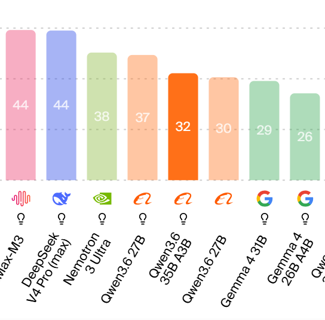
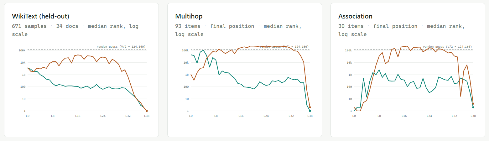
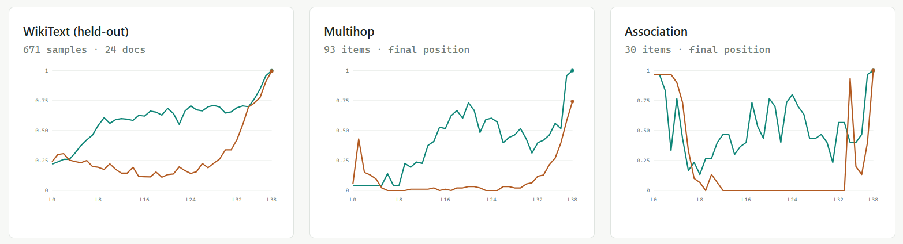
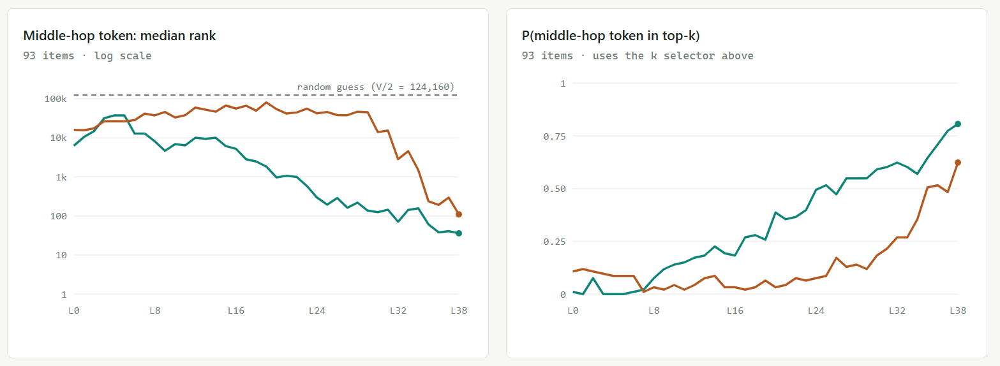

## Meet the Model

Qwen3.6-35B-A3B is a decently smart model! It scores 32 on the Artificial Analysis Index, beating Gemma-4-31B with 29 (a famously parameter-efficient model) and Nemotron 3 Ultra 550B-A55B with 38 (that's a bit embarrassing for Nemotron!)

I chose to use it because it's quite smart while being very efficient to run training and inference on. Qwen3.6 27B is significantly smarter, but also costs ~9x more, and the smaller Qwens seem a little too dumb.

Let's do some interp on it!

## J-Lens

[Link to reference paper](https://transformer-circuits.pub/2026/workspace/index.html)

'Training' the J-lens (I mean, you're adding gradients; that's training, right...?) converges extremely quick. 100 prompts (~10,000 data samples) versus 1,000 prompts (~100,000 data samples) makes no statistical difference.

We evaluate the J-lens at detecting which token the model is going to say next (the logitlens task) and detecting the in-between hops in multi-hop reasoning.

These are the median rankings for the ground-truth next token; lower is better,  logarithmically scaled so lower is a LOT better! 

These are the probabilities that the ground-truth next token is in the top 250 guesses; higher is better. 

We can see that the J-Lens is pretty much always destroying the logit lens by multiple orders of magnitude, except at the very beginning. I had Claude run a small investigation into what's going on here --- it turns out that the logit lens is decent at guessing basic token-level similarities while, at the same time, the J-Lens sort of degrades for early layers. 

In the multihop eval, we ask a question like "What is the currency in the country shaped like a boot?" and set the ground truth middle hop as the intermediate, in this example, "Italy". (determined via LLM grader)

The same behavior emerges, with the J-lens showing significantly better performance except at the very early layers. 

Final product on Hugging Face:

[J-Lens Weights](https://huggingface.co/stanleytheli/qwen3.6-35B-A3B-jlens)

## Natural Language Autoencoder (NLA)

[Link to reference paper](https://transformer-circuits.pub/2026/nla/index.html)

There was pretty huge hype on these. Can we get them to live up to the name? We choose Layer 29 out of Qwen's 40, admittedly pretty arbitrarily.

My first experiments used Deepseek-generated summaries for the SFT warmup, using the same system prompt as the Anthropic paper. For example, we have the David Bowie snippet:

> Clothes are so telling of who a person is. A suit says you might work in an office, an apron may mean a kitchen job, and purple tights paired with a splatter paint blouse could just say you're wearing a discarded art project. I love that we live in a time that has seen so much history filled with people who encourage and inspire others to be different. Of course, at this time, David Bowie stands out in my mind who made it seem ok, almost normal, to use fashion to express yourself. He had a long and

Here's a concised down version of Deepseek's "summary":

> Syntactic/structural constraint: "He had a long and" requires a coordinated adjective (e.g., "career", "life")… Immediate semantic expectation: The sentence about David Bowie's influence and legacy is unfinished… Final feature: The last token "and" is a coordinating conjunction awaiting a second adjective or noun phrase, creating immediate syntactic pressure for a completion like "successful" or "varied"…

Training our full SFT schedule (2900 steps), we only get 4% variance explained at the end. Anthropic's reference numbers are 30-40% by the end of SFT. Deepseek seems to overindexing on grammatical rules and underthinking about the core concepts, themes, and tone in the snippet.

I change the system prompt to remove mention of grammatical rules and encourage more 'intuitive' explanations. I also move from Deepseek to Qwen3.6-35B-A3B, the target model, because it turned out it's faster to run these things myself than to call Deepseek's API. 

Here's the updated explanation:

> The text reflects on clothing as a strong indicator of personal identity and profession. It contrasts standard professional attire with eccentric artistic choices like purple tights… The final portion begins to express appreciation for the current era's diversity in fashion expression.

Using these, and running the same SFT pipeline, we get up to 37% variance explained (FVE). That's looking more like it!

|RL Steps|Cosine Similarity|FVE|
|---|---|---|
0|0.72|37%
200|0.86|58%
1200|0.88|64%
1500|0.74|N/A

Woah, what happened!? Our RL collapsed, our model quickly exploded in KL divergence from the SFT checkpoint, and average response length exploded while reward shot down. Peak seemed to occur somewhere near 1200 steps. I tried increasing batch size, decreasing learning rate, and resetting KL penalty to the 1200 peak, but it still seemed like RL had stalled. (In the future, it might be worthwhile to just try a really long RL run.)

Final product on Hugging Face:

[Activation Verbalizer (AV) Weights](https://huggingface.co/stanleytheli/qwen3.6-35B-A3B-av-RL1200)

[Activation Reconstructor (AR) Weights](https://huggingface.co/stanleytheli/qwen3.6-35B-A3B-ar-sft)

## Sparse Autoencoder (SAE)

We train BatchTopK SAEs for layers 10, 20, and 30 on 350M tokens. We use k=32 features; k=64 was tested and gave small benefits while significantly dropping interpretability scores. A learning rate schedule seems to help, increasing FVE ~2 percentage points.

|Layer|FVE|
|---|---|
|10|72.8%|
|20|69.6%|
|30|71.6%|

For our autointerp pipeline, we ask an LLM grader to interpret the feature from examples of text that activated it. The baseline achieves ~71% balanced accuracy on a held-out test set, ergo, its feature had 71% balanced prediction power on examples the grader didn't get to see (as judged by YET ANOTHER llm grader!).

We try an experiment where we give it a chance to see a few examples it got wrong then refine its answers. We make sure to still eval against examples it never saw. This increases bal. acc. to 72%. 

We try giving it the activation magnitude, which boosted the bal. acc. to 75%. We also try giving it activation magnitude and allowing it to refine, but this only provied a really marginal increase 75.3%, so I didn't think it was worth the trouble. 

All of these figures are averaged across layers 10, 20, and 30. Looking closer, it seems interpretability drops as layer increases. We also measure the Spearman correlation: ask an LLM grader to rank the examples in terms of the feature label, then compare the correlation of those rankings to the true SAE activation magnitude rankings.

|Layer|FVE|Bal. Acc|Spearman|
|---|---|---|---|
|10|72.8%|78.3%|0.553|
|20|69.6%|75.3%|0.508|
|30|71.6%|71.0%|0.396|

We get bal. acc of ~70-80% and spearmans of ~0.4-0.55, which are pretty in line with the literature. These are low numbers! SAEs are fickle, imprecise instruments, and I'm excited for what concept decoding tools the interp community develops in their stead.

Final product on Hugging Face:

[SAE Weights](https://huggingface.co/stanleytheli/qwen3.6-35b-a3b-saes)
